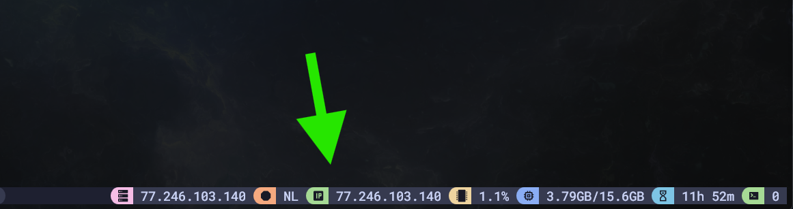

# tmux-ip-info

Display public IP address and country code in tmux status bar.



## Installation

Add to your `tmux.conf`:

```bash
set -g @plugin 'egracens/tmux-ip-info'
```

Press `prefix + I` to install.

## Usage

Add to your status bar:

```bash
set -g status-right "#{ip_address} (#{ip_country})"
```

The plugin exports two variables:
- `@ip_address` - your public IP address
- `@ip_country` - two-letter country code

Reference them as `#{E:@ip_address}` and `#{E:@ip_country}` in other tmux options.

## How It Works

- Fetches IP from icanhazip.com (Cloudflare)
- Fetches country from db-ip.com
- Caches results for 60 seconds to avoid rate limiting

## Catppuccin Theme

Create module files:

```bash
# ~/.config/tmux/modules/ip.conf
%hidden MODULE_NAME="ip"

set -gq "@catppuccin_${MODULE_NAME}_icon" "󰩟 "
set -gqF "@catppuccin_${MODULE_NAME}_color" "#{E:@thm_green}"
set -gq "@catppuccin_${MODULE_NAME}_text" " #{E:@ip_address}"

source -F "$HOME/.config/tmux/plugins/tmux/utils/status_module.conf"
```

```bash
# ~/.config/tmux/modules/country.conf
%hidden MODULE_NAME="country"

set -gq "@catppuccin_${MODULE_NAME}_icon" "󰏃 "
set -gqF "@catppuccin_${MODULE_NAME}_color" "#{E:@thm_peach}"
set -gq "@catppuccin_${MODULE_NAME}_text" " #{E:@ip_country}"

source -F "$HOME/.config/tmux/plugins/tmux/utils/status_module.conf"
```

Source the modules in your `tmux.conf`:

```bash
source -F "$HOME/.config/tmux/modules/country.conf"
source -F "$HOME/.config/tmux/modules/ip.conf"
```

Add to status bar:

```bash
set -g status-right "#{E:@catppuccin_status_country}"
set -ag status-right "#{E:@catppuccin_status_ip}"
```

## License

MIT
